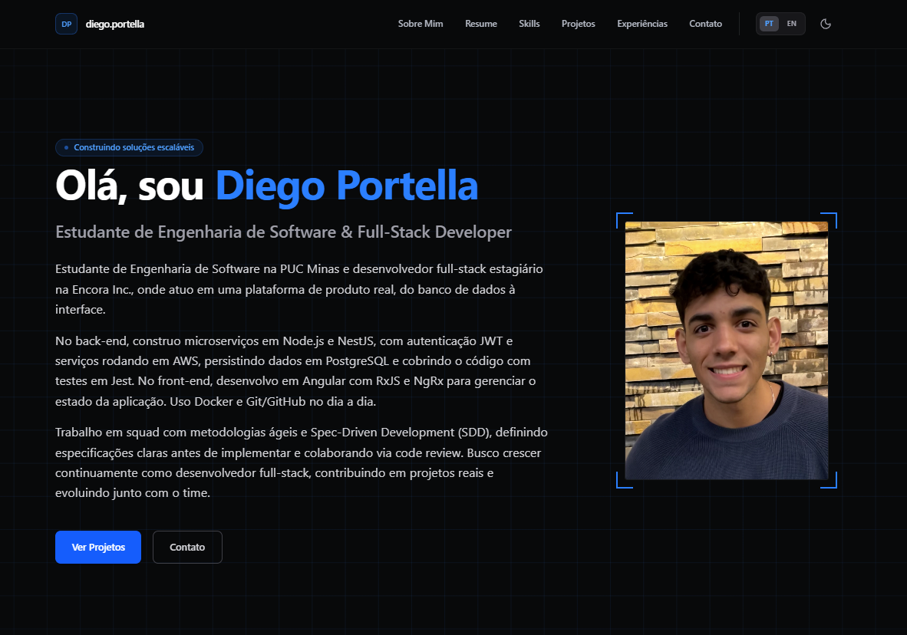

# Diego Portella | Professional Portfolio



Um portfólio profissional, bilíngue e interativo, desenvolvido para apresentar projetos, competências e experiências. A aplicação combina uma estética **tech/terminal** com visualizações 3D avançadas e design responsivo, focado em proporcionar uma excelente experiência de usuário (UX).

## ✨ Destaques e Funcionalidades

* **Arquitetura Moderna:** Construído com Next.js 15 (App Router) e React 19, garantindo alta performance e renderização otimizada.
* **Internacionalização (i18n):** Suporte nativo e instantâneo para Português (PT-BR) e Inglês (EN), gerenciado através da Context API (`LanguageContext`).
* **Tema Dark/Light:** Alternância de temas fluida utilizando `next-themes` e Tailwind CSS v4.
* **UI/UX Avançada:** Design responsivo *edge-to-edge*, navegação lateral estilo *Scroll Spy* com `Intersection Observer` e grid de fundo estilizado com máscaras radiais.
* **Globo 3D de Habilidades:** Visualização interativa e performática construída com Three.js e React Three Fiber, distribuindo os ícones através do algoritmo da Esfera de Fibonacci.
* **Integração de E-mail:** Formulário de contato totalmente funcional conectado diretamente à caixa de e-mail através do EmailJS (*Client-Side*).

## 🛠 Tecnologias Utilizadas

### Frontend & UI

* [Next.js 15](https://nextjs.org/) — Framework React
* [React 19](https://react.dev/) — Biblioteca para construção da interface
* [Tailwind CSS v4](https://tailwindcss.com/) — Framework CSS
* [Lucide React](https://lucide.dev/) — Ícones
* [React Icons](https://react-icons.github.io/react-icons/) — Biblioteca de ícones
* [Devicon](https://devicon.dev/) — Ícones de tecnologias

### 3D & Animações

* [Three.js](https://threejs.org/) — Renderização 3D
* [React Three Fiber](https://docs.pmnd.rs/react-three-fiber/) — Integração entre React e Three.js
* [Drei](https://github.com/pmndrs/drei) — Helpers e componentes para React Three Fiber

### Linguagem

* [TypeScript](https://www.typescriptlang.org/)

### Infraestrutura & Serviços

* [EmailJS](https://www.emailjs.com/) — Envio de mensagens através do formulário de contato
* [Vercel](https://vercel.com/) — Deploy e hospedagem

## ⚙️ Como executar o projeto localmente

### Pré-requisitos

Antes de começar, certifique-se de ter instalado:

* [Node.js](https://nodejs.org/) — versão 18.17 ou superior
* npm, yarn ou pnpm

### 1. Clonar o repositório

```bash
git clone https://github.com/diegovitorportella/portfolio-profissional-diaw.git
cd portfolio-profissional-diaw
```

### 2. Instalar as dependências

```bash
npm install
```

### 3. Configurar as variáveis de ambiente

Crie um arquivo `.env.local` na raiz do projeto e adicione as credenciais do EmailJS para que o formulário de contato funcione:

```env
NEXT_PUBLIC_EMAILJS_SERVICE_ID=seu_service_id_aqui
NEXT_PUBLIC_EMAILJS_TEMPLATE_ID=seu_template_id_aqui
NEXT_PUBLIC_EMAILJS_PUBLIC_KEY=sua_public_key_aqui
```

> **Importante:** Nunca compartilhe suas credenciais privadas ou faça commit do arquivo `.env.local` no repositório.

### 4. Executar o servidor de desenvolvimento

```bash
npm run dev
```

Depois, abra http://localhost:3000 no navegador.

## 📁 Estrutura do Projeto

```text
portfolio-profissional-diaw/
├── public/
│   └── preview.png
├── src/
│   ├── app/
│   ├── components/
│   ├── contexts/
│   └── ...
├── .env.local
├── package.json
├── next.config.ts
├── tsconfig.json
└── README.md
```

## 👨‍💻 Autor

### Diego Portella

**Desenvolvedor Full-Stack & Estudante de Engenharia de Software na PUC Minas**

Sempre focado na construção de aplicações escaláveis, arquiteturas sólidas e experiências digitais centradas no usuário.

* 💼 [LinkedIn](https://www.linkedin.com/in/diegoportella26/)
* 💻 [GitHub](https://github.com/diegovitorportella)
* 📸 [Instagram](https://www.instagram.com/_diegoportella_/)

---

⭐ Se você gostou do projeto, considere deixar uma estrela no repositório!
